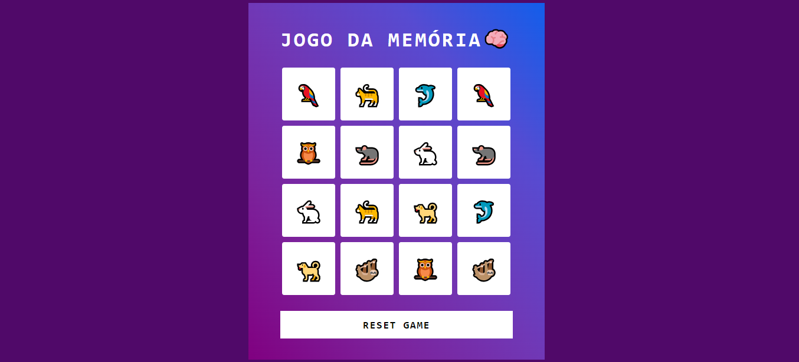

## 🎮 Projeto Jogo da Memória 🧠
Desafio de projeto proposto pelo expert Felipe Aguiar da plataforma da DIO (Digital Innovation One).  
O objetivo desse projeto é criar um Jogo da Memória utilizando HTML, CSS e JavaScript.

## 💻 Tecnologias usadas:

  
  
  

## 🖥 Preview do Jogo:
Jogo em um Desktop:

  

 

Jogo em um celular por exemplo:

  

 

- Venha jogar acessando [aqui nesse link do GithubPages]()

## ⚙ Execução do Jogo
1. **Clonar Repósitório:** basta utilizar o comando `git clone` para clonar esse projeto e salvar na máquina e depois executar o arquivo `index.html`.
2. **GitHubPages:** pode também acessar o projeto nesse [link](), que abrirá esse projeto no GitHubPages, sem precisar baixar o repositório na sua máquina.

## 🕹 Como jogar
- Por se tratar de um Jogo da Memória, o objetivo é encontrar cada par de emojis.
- O jogador deverá clicar em um quadrado e encontrar o outro par idêntico em um outro quadrado. Caso o par seja correto, os quadrados do par de emojis ficarão visíveis na tela.
- O jogo é finalizado quando todos os pares de emojis forem encontrados.

## 🤔 O que foi feito de diferente nesse jogo:
- Aplicado responsividade no projeto utilizando os conceitos de Mobile First;
- Áudios de erros e acertos aplicados no jogo;
- Utilizado Favicon.

## 📌 Créditos
- **Áudios:** Disponível no site [FreeSoundEffects.net
](https://free-sound-effects.net/);
- **Favicon:** Disponível no site [Flaticon](https://www.flaticon.com/br/icones-gratis/)